# Pa que aiga lujo — The Hackers Labs

**Author:** Sammy Odeh  
**Date:** May 2026  
**Platform:** The Hackers Labs  
**Difficulty:** -  
**OS:** Linux  
**Topics:** Network Scanning · Brute Force · Docker Pivoting · Drupalgeddon2 · Privilege Escalation

---

## Table of Contents

1. [Reconnaissance](#1-reconnaissance)
2. [Enumeration](#2-enumeration)
3. [Exploitation](#3-exploitation)
4. [Privilege Escalation & Pivoting](#4-privilege-escalation--pivoting)
5. [Persistence](#5-persistence)

---

## 1. Reconnaissance

The machine is connected to a Host-Only network in VirtualBox (`vboxnet0`), isolating it from the internet while keeping it reachable from the attacker machine.

A network scan with `netdiscover` reveals two hosts:
- `192.168.56.100` — attacker machine
- `192.168.56.111` — target machine

<!-- Figure 1: netdiscover output -->
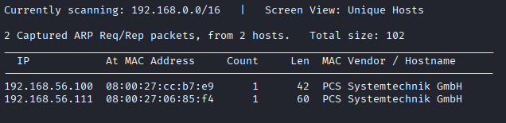

A full port scan with Nmap gives us a clear initial attack surface: **HTTP on port 80** and **SSH on port 22**.

<!-- Figure 2: Nmap full scan -->
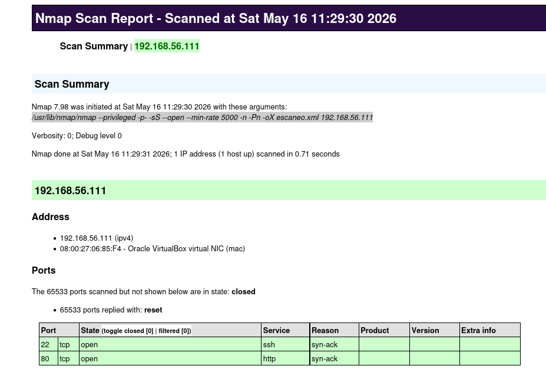

A more detailed scan with version detection and default scripts reveals:

| Service | Details |
|---------|---------|
| SSH | OpenSSH 9.2p1 — Debian 12 |
| HTTP | Apache 2.4.62 — "LuxeCollection - Artículos de Lujo Exclusivos" |
| OS | Linux (confirmed by CPE) |

<!-- Figure 3: Nmap targeted scan -->
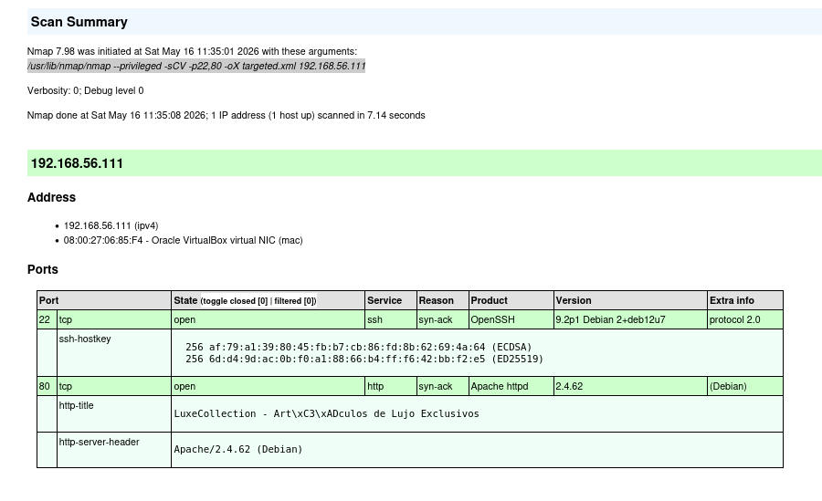

---

## 2. Enumeration

Browsing to `http://192.168.56.111` reveals a luxury watch store called **LuxeCollection**. Running `whatweb` confirms:

| Field | Value |
|-------|-------|
| Response | 200 OK |
| Server | Apache 2.4.62 (Debian Linux) |
| Technology | HTML5 |
| Email | info@luxecollection.com |

<!-- Figure 4: whatweb output -->
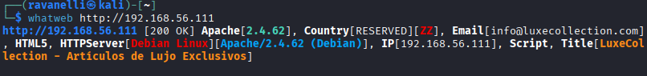

Running `gobuster` only finds static paths (`/scripts`, `/styles`) with no useful content.

<!-- Figure 5: Gobuster output -->
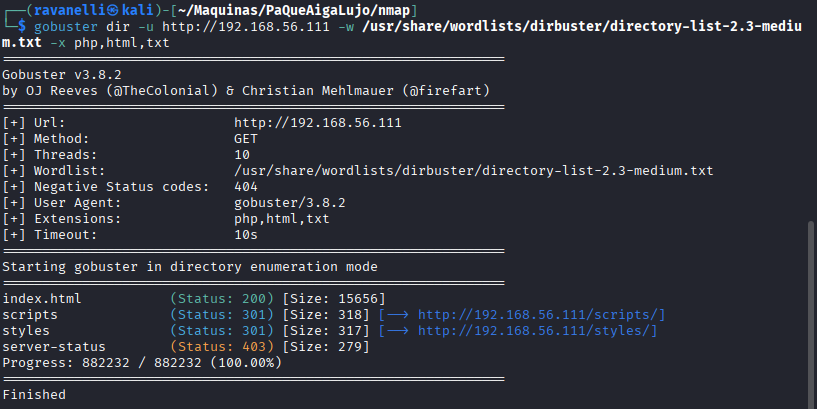

However, reviewing the web content reveals something valuable: **a list of usernames** found in product comments:

```
carlos, isabella, alexandre, miguel, elena, victoria, anastasia,
sophia, roberto, james, catherine, valentina, priscilla, margot,
beatrice, alessandro, marcus, diego, winston, maximilian
```

With SSH open on port 22, these names could be valid system users. A custom wordlist is created for a brute-force attack.

<!-- Figure 6: Web content -->
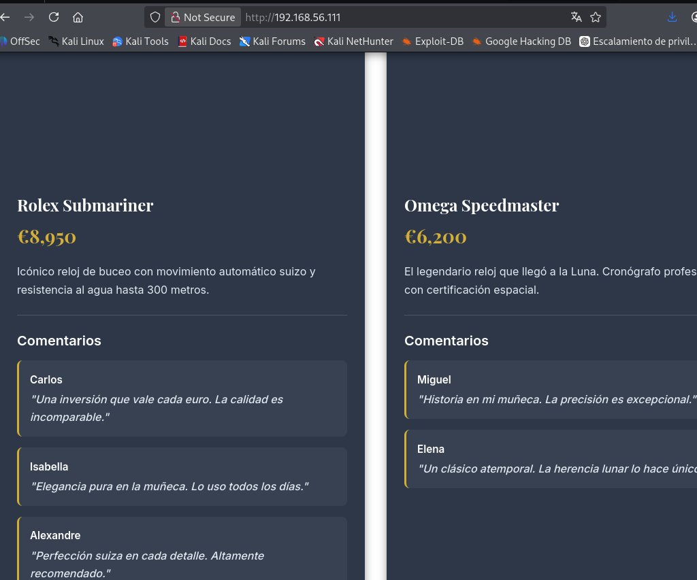

---

## 3. Exploitation

### SSH Brute Force

A wordlist is built from the collected usernames and fed into **Hydra** alongside `rockyou.txt`, limiting parallel tasks to 4 to avoid connection resets.

```bash
hydra -L usuarios.txt -P /usr/share/wordlists/rockyou.txt ssh://192.168.56.111 -t 4
```

<!-- Figure 7: Users wordlist -->
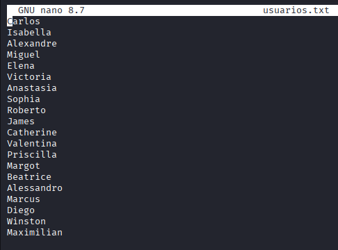

<!-- Figure 8-9: Hydra attack and credentials -->
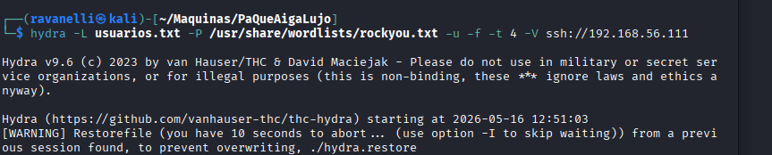
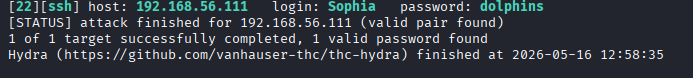

Valid credentials found: **`sophia:dolphins`**

### Docker Discovery

After logging in via SSH, running `ip a` reveals:
- `enp0s3` — `192.168.56.111` (Host-Only network)
- `docker0` — `172.17.0.1/16` (internal Docker network)
- An active `veth` interface — indicating a running Docker container

<!-- Figure 10: Network interfaces -->
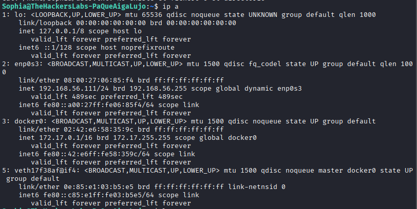

Reviewing `/etc/passwd` shows four users with valid shells: `root`, `debian`, `Sophia`, `cipote`.

The Docker container at `172.17.0.2` is alive and has **port 80 open**.

<!-- Figure 11-12: Users and Docker -->
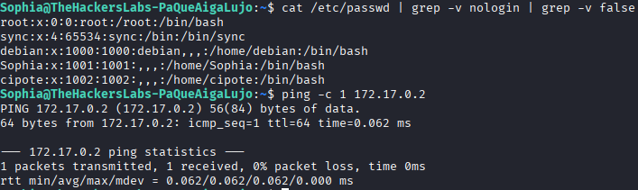
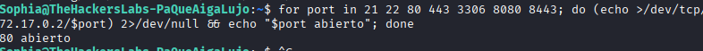

### Drupalgeddon2 (CVE-2018-7600)

The container is running **Drupal 8 with PHP 7.2** — a combination known to be vulnerable to **Drupalgeddon2**, a critical RCE vulnerability affecting Drupal < 7.58 and < 8.5.1.

<!-- Figure 13: Drupal discovery -->
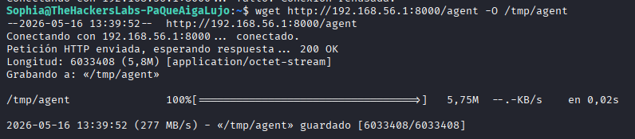

### Tunneling with Ligolo-ng

To reach the internal Docker network from the attacker machine, **Ligolo-ng** is used:

1. Create `tun` interface and add route to `172.17.0.0/16`
2. Launch proxy on Kali
3. Serve the agent via HTTP and download it from the victim machine
4. Execute the agent to establish the tunnel

<!-- Figures 14-19: Ligolo setup -->
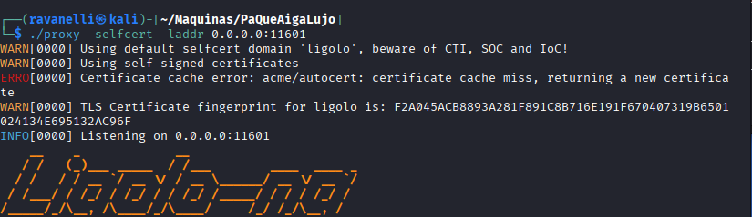
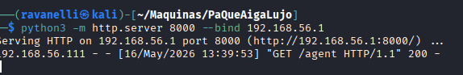

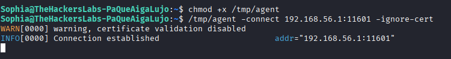
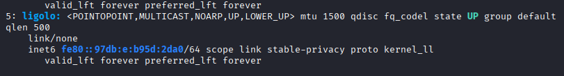
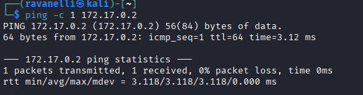

### Metasploit — Drupalgeddon2

With the tunnel active, Metasploit is used to exploit Drupalgeddon2:

```
use exploit/unix/webapp/drupal_drupalgeddon2
set RHOSTS 172.17.0.2
run
```

A Meterpreter session opens. Running `whoami` confirms code execution as **`www-data`** inside the Docker container.

<!-- Figures 20-21: Metasploit -->
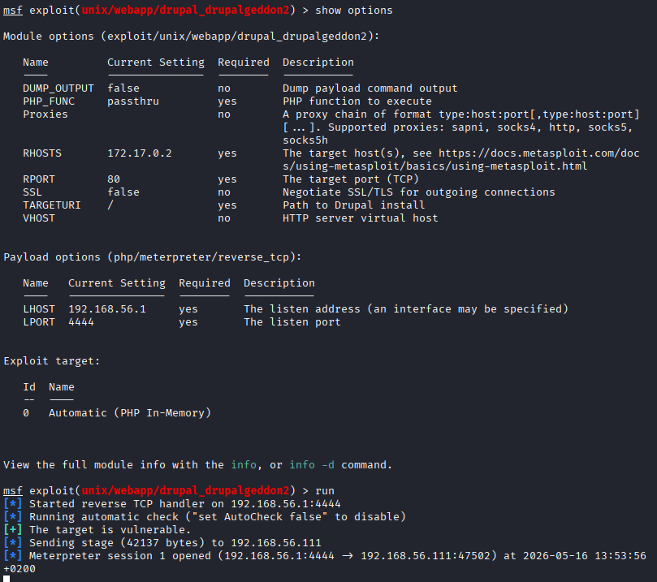
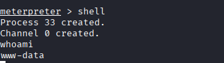

---

## 4. Privilege Escalation & Pivoting

### Container — www-data → ballenita

Credentials found in plaintext inside `sites/default/settings.php` (Drupal config file). Used to switch to user **`ballenita`** via `su`.

<!-- Figures 22-23: ballenita -->
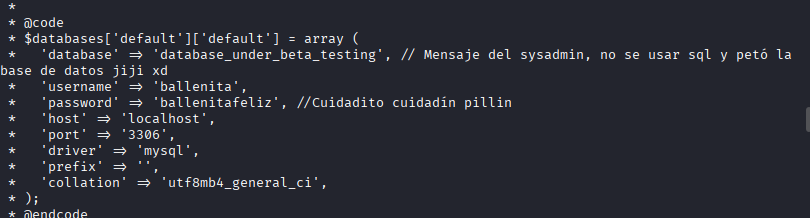
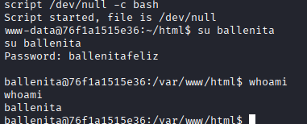

### Container — ballenita → root (partial)

`sudo -l` reveals that `ballenita` can run `/bin/ls` and `/bin/grep` as root without a password.

<!-- Figure 24: ballenita sudo -->
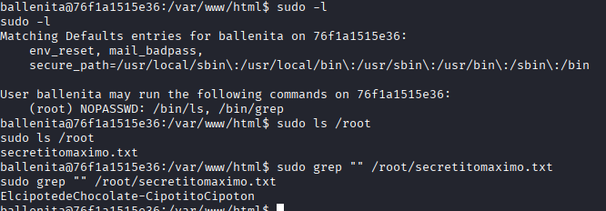

Using these to read `/root/secretitomaximo.txt`:

```bash
sudo ls /root
sudo grep "" /root/secretitomaximo.txt
```

The file contains a string that turns out to be the password for user **`cipote`** on the main machine.

### Main Machine — cipote → root

SSH into the main machine as `cipote` and find the user flag.

<!-- Figure 25: cipote -->
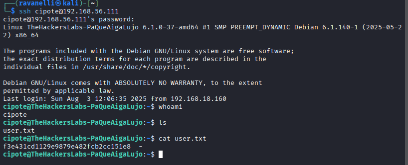

`sudo -l` shows that `cipote` can run `/usr/bin/mount` as root without a password.

<!-- Figure 26: cipote sudo -->
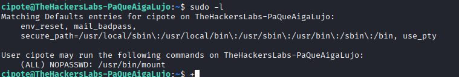

Using **GTFOBins**, `mount` is abused to escalate to root by binding `/bin/bash` over the binary and executing it as root.

<!-- Figures 27-28: Root and lab complete -->
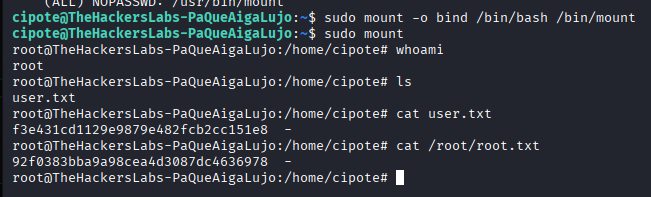
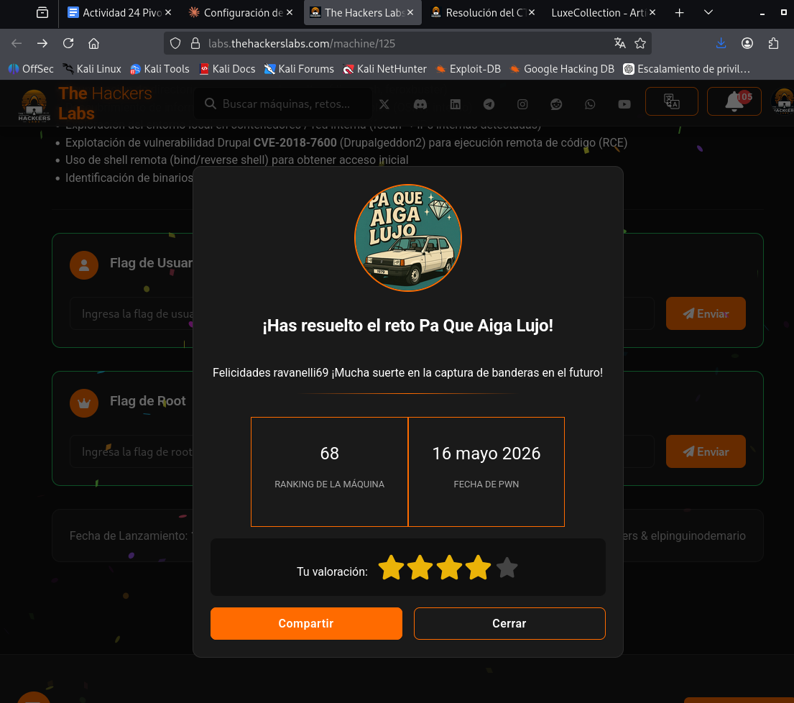

---

## 5. Persistence

As root, a backdoor user is created with a bash shell and added to the `sudo` group, ensuring persistent access even if the session is lost:

```bash
useradd -m -s /bin/bash backdoor
passwd backdoor
usermod -aG sudo backdoor
```

<!-- Figure 29: Persistence -->
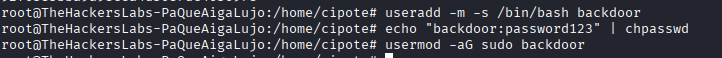

---

## Summary

| Step | Technique | Tool |
|------|-----------|------|
| Recon | Network + port scanning | netdiscover, Nmap |
| Enumeration | Web content analysis, directory bruteforce | whatweb, gobuster |
| Initial access | SSH brute force | Hydra |
| Pivoting | Tunnel to Docker network | Ligolo-ng |
| Exploitation | Drupalgeddon2 RCE (CVE-2018-7600) | Metasploit |
| PrivEsc (container) | Sudo misconfiguration (ls, grep) | Manual |
| PrivEsc (host) | Sudo misconfiguration (mount) + GTFOBins | Manual |
| Persistence | Backdoor user creation | Manual |

---

*Published under [Creative Commons Attribution-ShareAlike 4.0](https://creativecommons.org/licenses/by-sa/4.0/)*
